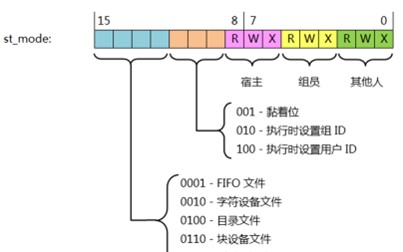

st_mode 主要包含了3部分信息：  
a. 15bit ~ 12bit 保存文件类型  
b. 11bit ~ 9bit  保存执行文件时设置的信息  
c. 8bit ~ 0bit   保存文件访问权限  

a.文件类型(7种)  
#define S_IFSOCK 0140000     套接口(sokect)  
#define S_IFLNK 0120000      符号连接文件(symbolic link)  
#define S_IFREG 0100000      普通文件(regular file)  
#define S_IFBLK 0060000      块设备(block device)  
#define S_IFDIR 0040000      目录(directory)  
#define S_IFCHR 0020000      字符设备(character device)  
#define S_IFIFO 0010000      管道(fifo)  

b.权限的特殊属性区域  
#define S_ISUID 0004000   set-user-ID位，执行时设置用户ID，让执行文件的用户以该文件拥有者的权限去执行，例如/usr/bin/passwd  
#define S_ISGID 0002000   set-group-ID位，执行时设置组ID，让执行文件的用户以该文件所属组的权限去执行，例如/usr/bin/locate  
#define S_ISVTX 0001000   粘滞位(sticky), 也叫做保存-正文位(saved-text bit)，普通文件的sticky位会被linux内核忽略，目录的sticky位表示这个目录里的文件只能被owner和root删除，例如/tmp。  

chmod u+s xxx # 设置setuid权限  
chmod g+s xxx # 设置setgid权限  
chmod o+t xxx # 设置stick bit权限，针对目录  

c.文件访问权限  
标识了文件所有者（owner）、组用户（group）、其他用户（other）的读（r）、写（w）、执行（x）权限